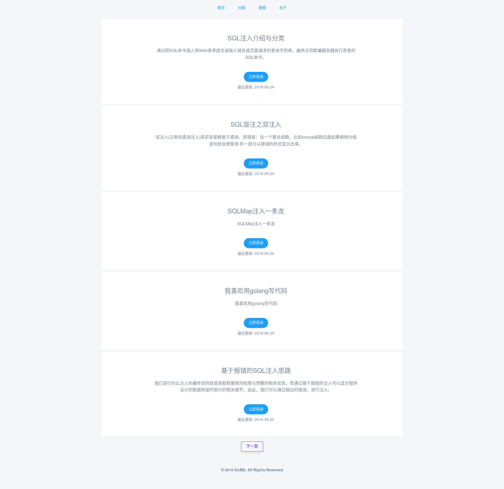
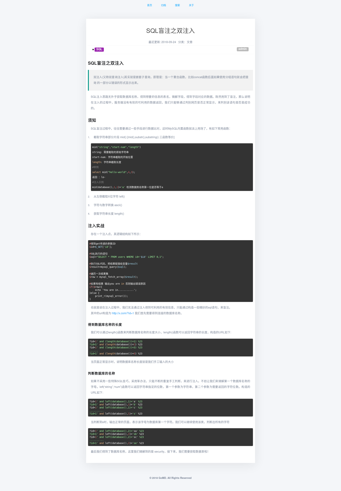
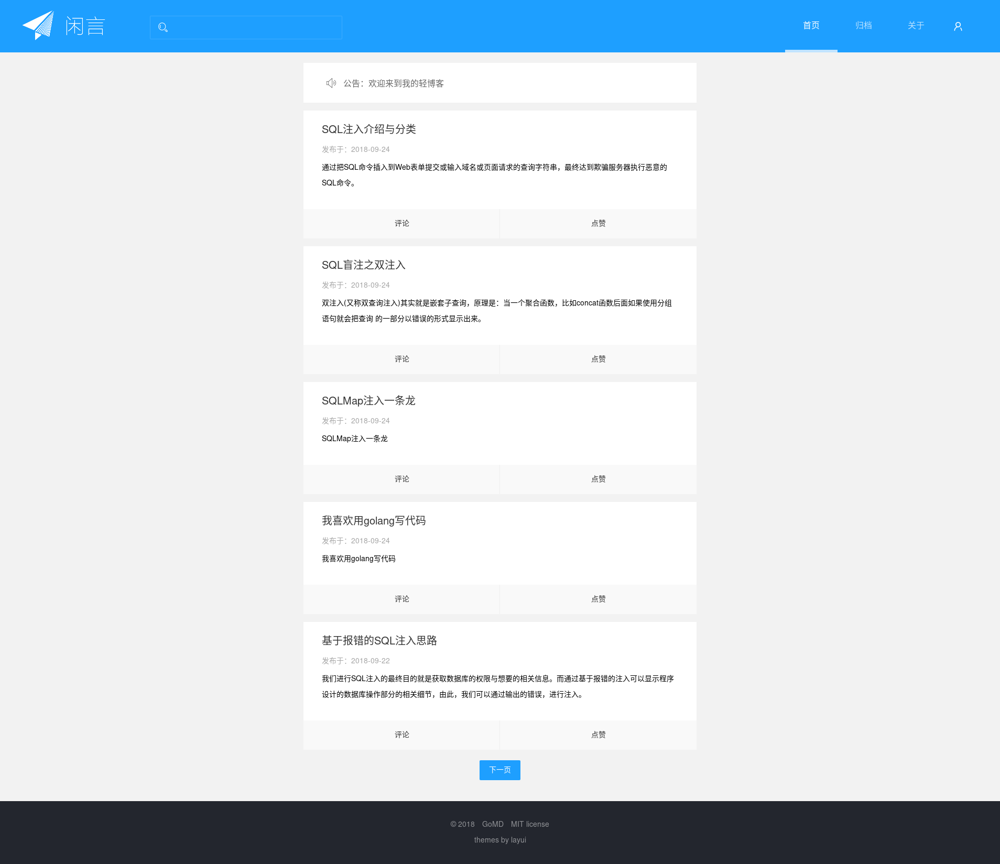
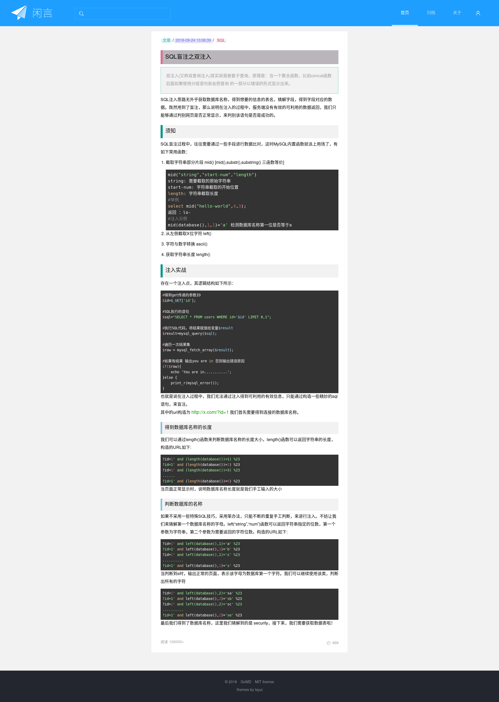
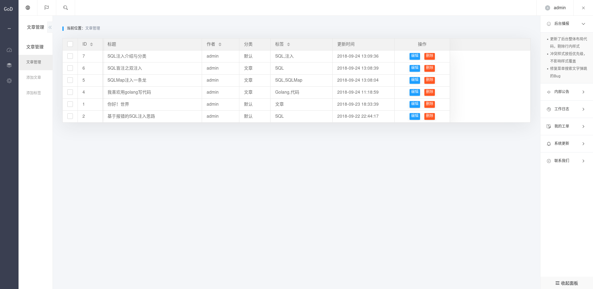
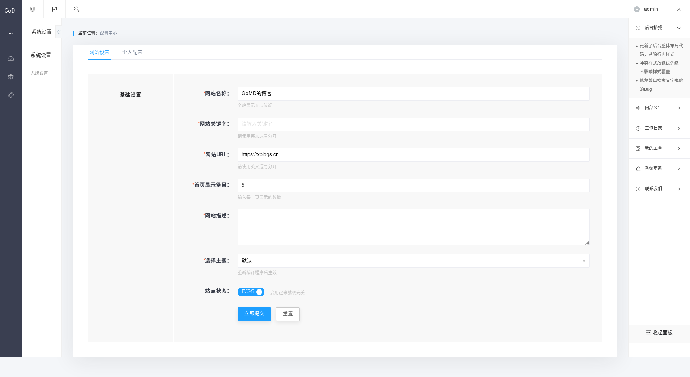

# golang实现的博客程序

## [演示](http://xblogs.cn)
## [后台](http://xblogs.cn/admin) 账号密码 admin/admin(请勿修改账户信息)

## 如何使用

> 本应用基于golang语言的[beego框架](https://beego.me/)开发,在确保安装了golang环境的条件下，执行如下命令

```bash
go get github.com/astaxie/beego
go get github.com/beego/bee
go get github.com/jmoiron/sqlx
go get github.com/mattn/go-sqlite3
go get gopkg.in/russross/blackfriday.v2
```

> 安装完以上库，克隆仓库到机器上

```shell
cd $GOPATH/src/
git clone https://gitee.com/xuthus5/GoMD.git
cd GoMD
```

## 关于数据库与配置文件

数据库使用sqlite3，无需配置，编译运行程序即可使用，项目运行起来后，访问 http://domain/admin 为后台地址 默认账号密码 admin/admin
配置文件位于 conf/app.conf `runmode = prod` 为可修改项，prod对应程序使用80端口，dev使用8080端口

> 编译运行，两种方法 建议使用方法二

```
#运行方法一
go run main.go
#运行方法二
bee run
```

**注意**

程序启动后，会在项目根目录下加锁 `install.lock` ，若希望重新部署项目，请备份数据后清除该文件与数据库文件 `data.db`


## 主题

### 默认




### 闲言




### 后台



